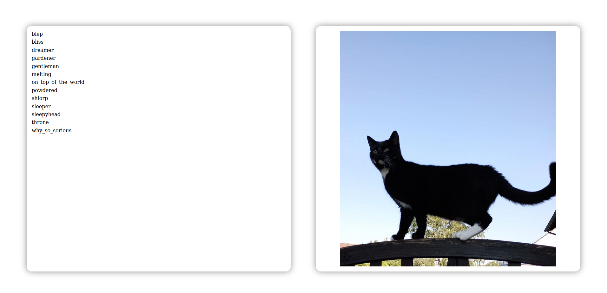

# A small cat picture API

Serves - a limited set of - cat pictures via a single Go binary as API and Client.

This is a practice project for Gin and Embed based on the [assets-in-binary](https://github.com/gin-gonic/examples/tree/master/assets-in-binary) example.

Runs in <localhost:8080>.

